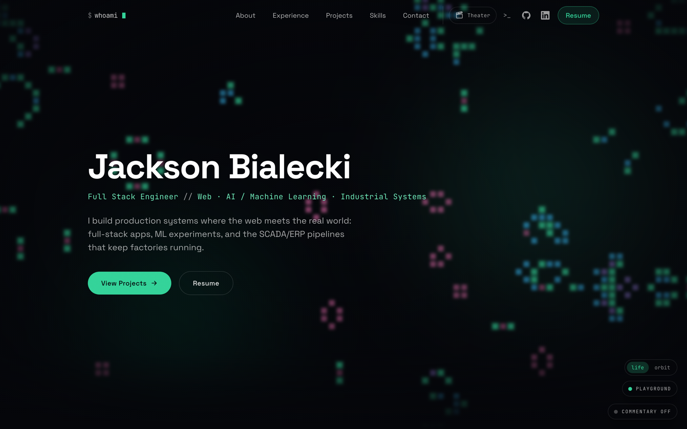
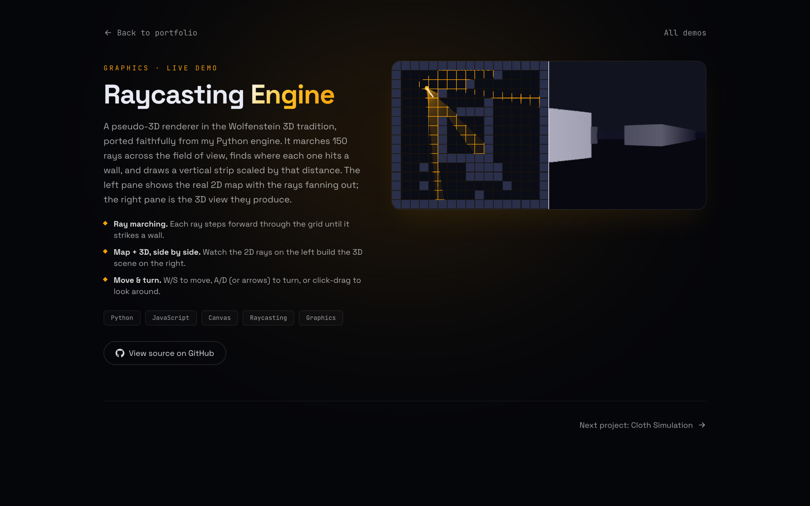
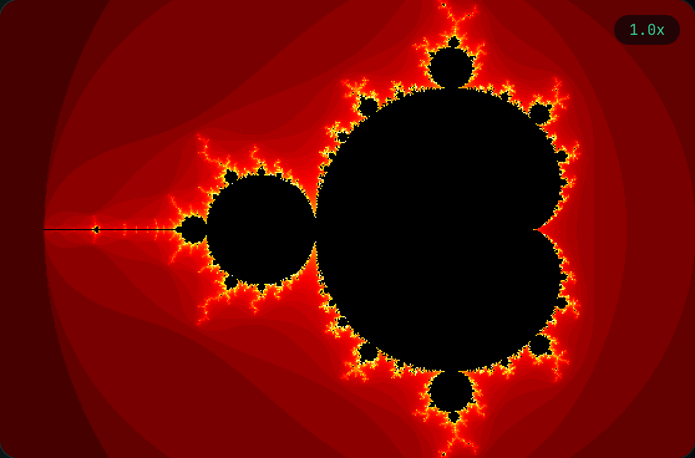

<div align="center">

# Jackson Bialecki

**Full-stack engineer · Web, AI/ML, and industrial systems**

The site behind [jbialecki.com](https://jbialecki.com): a WebGL hero, sixteen film modes that restyle the whole site, seven interactive demos you can play in the browser, a guest terminal, and write-ups of the software I've shipped on a factory floor and at an ed-tech startup.

[](https://jbialecki.com)
&nbsp;
&nbsp;
&nbsp;
&nbsp;

<br>

**[Open the live site →](https://jbialecki.com)**



</div>

---

## Highlights

- **A WebGL hero.** A noise-displaced icosahedron and a GPU particle field, both driven by custom GLSL vertex and fragment shaders, under a camera that eases toward the cursor. It's code-split out of the main bundle and capped to the device pixel ratio, so it stays smooth on a phone and collapses to a still frame under reduced-motion. A corner toggle swaps the whole scene for a live Game of Life.
- **Sixteen film modes.** Pick a film from the theater wall and the site re-themes to match: a color grade applied before first paint, a score with per-section audio cues, and a visual layer built for that film (WarGames draws a live missile-map simulation). A date-hashed feature presentation screens one film per day for first-time visitors, and every track is attributed on `/film-credits`.
- **A guest terminal.** `cd`, `ls`, `cat`, and tab completion over a virtual filesystem generated from the same typed registries that render the pages, so the terminal can never drift from the site it navigates. It opens any route and applies any film grade.
- **Director's commentary.** A toggle that pins a commentary track to each home section: the site explaining how it's engineered, with a link to the exact source file on GitHub.
- **A playground takeover.** Flip the switch and live simulations run behind the home page itself, Game of Life behind Projects and the cloth sim behind Skills, with a persistent scoreboard.
- **Seven interactive demos.** Six began as Python projects and were rebuilt in JavaScript and canvas: a raycaster, a Verlet cloth, Conway's Game of Life, the Mandelbrot set, a perceptron, and the pi-from-collisions trick. The Neuroevolution Flappy Bird runs as its original p5.js build, embedded live. All seven share one canvas scaffold that handles DPR sizing, pauses off-screen, and holds a still frame under reduced-motion.
- **A serverless contact backend.** The form posts to `/api/contact`, which validates the payload, blocks bots with a honeypot, rate-limits by IP through a clock-injectable limiter with bounded memory, and sends mail through Resend. With no API key set it stays working and shows a friendly "email me directly" message.
- **Case studies, written up as problem, approach, and outcome.** A manufacturing dashboard at Voyage Foods, a Canvas LMS integration at JAKAPA, shipping on a 50+ engineer team at LCS, a solo database migration at American Equity Funding, and two personal builds: an 8-bit computer wired by hand on breadboards, and a self-hosted archiver that keeps 11,000+ short-form videos on my own disk.
- **Production plumbing.** Vercel CI/CD, a generated Open Graph image, a sitemap, robots rules, JSON-LD structured data, and five Playwright suites that run in CI so a bad change can't quietly break a route.

## Film modes

Everything about a film lives on one record in `lib/films/`: its color grade, its audio cues, its visual assets, and its media credits. The compiler enforces that every film id has exactly one record, and the rest of the system derives from there. The grade module turns a record into CSS custom properties and a pre-paint boot script, the audio director schedules its cues as you scroll, the theater wall renders its poster, and the credits page prints its attributions. Swapping a track is a one-file edit.

## Interactive demos

<p align="center">
  
  
</p>

Each one runs live in the browser, and most link to their source on GitHub from the site.

| Demo | What it is | Play |
| --- | --- | --- |
| Neuroevolution Flappy Bird | 50 neural-network birds evolve until they clear the pipes on their own | [▶ Live](https://jbialecki.com/flappy) |
| Raycasting Engine | Wolfenstein-style pseudo-3D from 150 rays, with the 2D map and the 3D view side by side | [▶ Live](https://jbialecki.com/raycaster) |
| Cloth Simulation | Point masses on Verlet springs that you can drag across to slice | [▶ Live](https://jbialecki.com/cloth) |
| Conway's Game of Life | Age-colored cellular automaton you can draw on | [▶ Live](https://jbialecki.com/game-of-life) |
| Mandelbrot Set | Escape-time fractal with click-to-zoom and rising iteration depth | [▶ Live](https://jbialecki.com/mandelbrot) |
| Perceptron | A single perceptron learning a linear boundary, step by step | [▶ Live](https://jbialecki.com/perceptron) |
| Pi from Collisions | Colliding blocks whose collision count spells out the digits of pi | [▶ Live](https://jbialecki.com/pi-blocks) |

## Built with

- **Framework:** Next.js 14 (App Router), TypeScript, React 18
- **3D and graphics:** Three.js, React Three Fiber, drei, custom GLSL shaders, HTML canvas
- **Motion:** Framer Motion, Lenis smooth scroll
- **Styling:** Tailwind CSS, a dark theme on a single emerald accent (`#34d399`), plus a film grade layer of CSS custom properties
- **Backend:** Resend, on a serverless Vercel route
- **Ops:** Vercel hosting and Analytics, Playwright, GitHub Actions CI

## Run it locally

```bash
npm install
npm run dev        # http://localhost:3000
```

Node 18.18 or newer (Node 20 recommended). Almost all copy lives in typed registries (`lib/data.ts` for the profile, experience, and projects; `lib/caseStudies.ts`; `lib/demos.ts`; `lib/films/`), so most content edits never touch a component, and the terminal, credits page, and commentary derive from the same data.

## Tests

```bash
npm run typecheck  # tsc over the app and the test suites
npm run build      # type-check, lint, and a production build
npm test           # Playwright (run `npx playwright install chromium` once first)
```

CI runs lint, the build, and the full Playwright run on every push and pull request. The smoke suite opens every page, confirms the canvases mount, and checks the main navigation; the other suites drive the film modes through a full pick-preview-commit lifecycle, exercise the guest terminal command by command, hit the contact API directly, and cover the feature presentation, commentary, and playground layers.

<details>
<summary><b>Project structure</b></summary>

```
app/
  page.tsx               Single-page portfolio (Hero, About, Experience, Projects, Skills, Contact)
  demos/page.tsx         The playground hub that lists every interactive demo
  flappy/                The Neuroevolution Flappy Bird game, embedded live
  raycaster/ cloth/ mandelbrot/ game-of-life/ perceptron/ pi-blocks/
                         One route per demo, each built on components/demos/DemoShell
  work/[slug]/page.tsx   Case-study pages (Voyage Foods, LCS, JAKAPA, AEF, 8-bit computer, media archiver)
  film-credits/page.tsx  Sources and licenses for the film-mode media
  resume/page.tsx        The PDF résumé, embedded with print and download
  api/contact/route.ts   Serverless contact endpoint (Resend)
  opengraph-image.tsx    Generated 1200×630 social card
  sitemap.ts robots.ts   SEO surface
components/
  home/ layout/ ui/      Page sections and shared primitives (theater dialog,
                         grade switcher, feature presentation)
  three/                 HeroScene, DistortedSphere, ParticleField, shared GLSL noise
  demos/                 DemoShell, the useDemoCanvas lifecycle hook, shared
                         chrome, and one component per demo
  film-experience/       AudioDirector, CinematicLayer, and per-film visual modes
  terminal/              The guest terminal
  commentary/            The director's-commentary overlay
  playground/            The behind-the-page simulation layer
lib/
  data.ts                Profile, experience, projects, skills (the single source of content)
  caseStudies.ts         Case-study content
  demos.ts               Registry that drives the playground hub
  films/                 One record per film; grades, audio, and credits derive from it
  grades.ts              Applies a film's color grade to <html>, including the pre-paint boot script
  terminal.ts            The terminal's command engine and virtual filesystem
  commentary.ts featurePresentation.ts playground.ts
  rateLimit.ts           Clock-injectable rate limiter behind the contact route
tests/
  smoke.spec.ts film-modes.spec.ts terminal.spec.ts
  uniqueness-suite.spec.ts contact-api.spec.ts
```

</details>

---

<div align="center">

Built by Jackson Bialecki · [jbialecki.com](https://jbialecki.com) · [LinkedIn](https://www.linkedin.com/in/jackson-bialecki/)

Available for co-op, Spring 2027.

</div>
